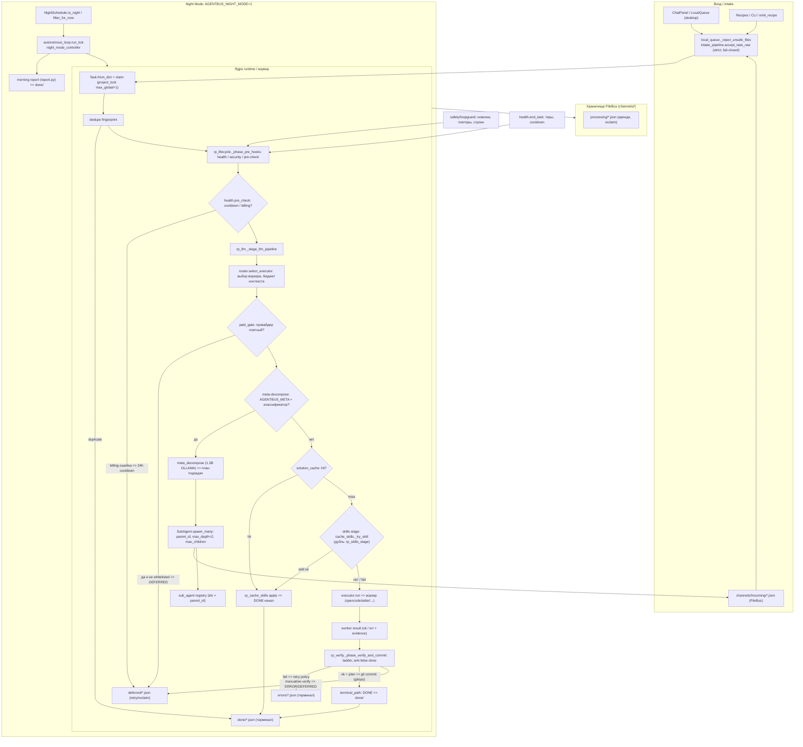

# DATA_FLOW_DIAGRAM.md — поток данных AgentBus

> Дата аудита: 2026-10-08.
> Источник истины по файлам: `src/core/*`, `src/intelligence/*`, `src/safety/*` (см. ссылки `файл:строка` в тексте).
> Все границы ниже — **_fail-closed_**: при сбое раннего фильтра задача не выполняется «по-тихому», а уходит в `ERROR`/`DEFERRED` с причиной.

## 1. Общая схема (Mermaid)

## 2. Поток по шагам (file-bus)

1. **Вход.** Внешний канал кладёт JSON в `channels/<chan>/incoming/`; desktop-чат идёт через `LocalQueue.put` → spill в `.agentbus/desktop_queue/` (`src/core/local_queue.py:41-64,166-186`). FileBus читает/переносит `incoming → processing` (`bus.py`, move = copy2 + unlink, устойчиво к Dropbox-lock).
2. **Intake (fail-closed).** `accept_task_raw` нормализует контракт (`task_contract.normalize_task`) и поднимает `IntakeError` при небезопасном payload/пути (`src/core/intake_pipeline.py:21-62`); desktop дополнительно фильтрует опасные пути в `_reject_unsafe_files` (`local_queue.py:17-28`).
3. **Claim.** Воркер забирает задачу с учётом глобального лока проекта (`project_lock.py`, `max_global=1`). Дубли отсекаются fingerprint'ом (`runtime.py:310-318 dedupe`).
4. **Pre-hooks.** `_phase_pre_hooks` (`rp_lifecycle.py`) прогоняет health pre-check: billing-пометки → cooldown, тайры ошибок → паузы (`health.py`). При billing-ошибке задача не семплируется платным провайдером повторно 24h.
5. **LLM-этап** `_stage_llm_pipeline` (`rp_llm.py:466, ~648 строк`):
   - роутер выбирает воркера и подгоняет контекст (`router.select_executor`, `LOCAL_CTX_BUDGET=6000`);
   - paid-gate: неизвестный провайдер трактуется **платным** → `DEFERRED` с причиной (`paid_gate.py`, см. `CONTRACTS_AUDIT.md`);
   - meta-decompose (env `AGENTBUS_META`): сложная задача → `meta_decompose` (1.5B через `OLLAMA_HOST`) → подзадачи от `SubAgent` с `parent_id` в `incoming` (`sub_agent.py:184-213 spawn_many/_save_registry`), глубина ≤ `MAX_DEPTH=2`, детей ≤ `DEFAULT_MAX_CHILDREN=8` / жёстко `ABSOLUTE_MAX_CHILDREN=16`;
   - solution-cache: hit → кэш-применение → DONE (быстрый путь, `rp_cache_skills.py`);
   - skills: `_try_skill` сначала из кэша навыков, иначе навык запускается как под-исполнитель; при неудаче → переход к воркеру.
6. **Worker.** `executor` вызывает выбранного воркера; результат — структура `WorkerResult` с evidence (`test_worker_contract_fc14`).
7. **Verify + terminal.** `_phase_verify_and_commit` (`rp_verify.py:24, 237 строк`): лестница верификации, анти-false-done; при ok + plan ≠ None → git-коммит (см. **TD-001**, баг `commit_plan`); терминальную папку определяет runtime через `terminal_path.py` (`FOLDER`: `DONE→done`, `ERROR→errors`, `DEFERRED→deferred`; `verification_allows_done` требует явный positive verify-сигнал).
8. **Терминалы.** `done/`, `errors/` — конечные; `deferred/` — повторный вход в `CLAIM` (reclaim, `reclaim.py` lease).

## 3. Поток desktop-чата

`ChatPanel → enqueue_desktop_task` (`local_queue.py:166`) → `LocalQueue` (per-root, spill для межпроцессности UI↔dispatcher) → воркер/dispatcher `claim()` (spill-восстановление) → тот же `_process_body` (шаги 4–8) → результат обратно в UI. Ошибка форматируется в human-readable строку (`error_ux`, `task_result.build_task_result`).

## 4. Night Mode

При `AGENTBUS_NIGHT_MODE=1` в `run_forever` дополнительно крутится автономный цикл (`runtime.py:587-606`; `autonomous_loop.run_tick` `autonomous_loop.py:152`, `night_mode_controller.run_autonomous_loop` `night_mode_controller.py:243`). `NightScheduler` (`night_scheduler.py:38-72`) выбирает задачи в ночном окне (`start 22:00/end 06:00`, `max_tasks_per_night`, `min_complexity`); утром пишется отчёт (`report.py`). Всё идёт через те же ворота верификации и paid-gate (вечером платных задач не набирают сверх бюджета).

## 5. Ключевые решения и риски

- **Fail-closed на всех границах** — единственный способ попасть в `done/` — вся лестница верификации + терминальный контроль `verification_allows_done`; воркер сам DONE не объявляет.
- **DESIGN** (риск): loops классифицируются как «шум модели», а не отказ воркера (`health.py`) — см. `TECHNICAL_DEBT_REGISTRY.md` TD-028.
- **KNOWN GAP (закрыт TD-001, 2026-10-08)**: при `AGENTBUS_GIT=1` путь DONE+git коммитит только `plan.stage` через реальный `gitops.commit` (вместо несуществовавшего `gitops.commit_plan`); при пустом `stage` коммит не требуется. См. TD-001.